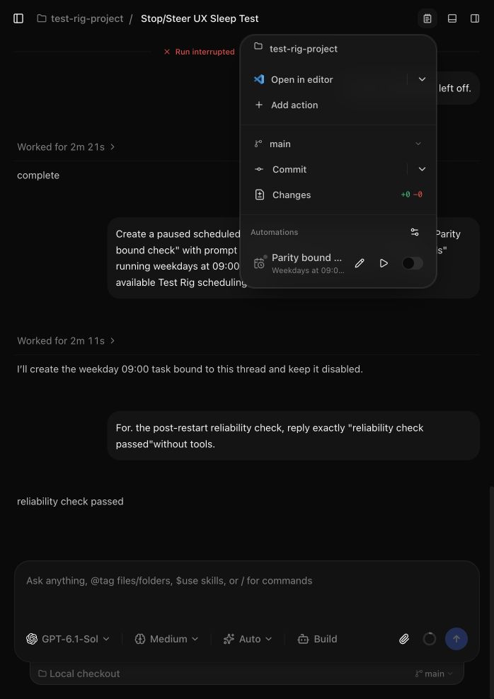

# Orchestrator V2 reliability repairs — October 6–7, 2026

This follow-up addresses the confirmed reliability findings left outside the earlier [UX implementation](orchestration-v2-parity-implementation.md). The original [audit](orchestration-v2-latest-audit.md) remains historical evidence. Repairs are in the working tree on `codex/orchestration-v2`, based on `2cd9bf400cefedd19206b09ff4f8d880a176d915`; no commit, push, PR, or Linear update was requested.

**Complete for the confirmed audit repair scope, October 7.** All 34 findings (R01–R34) are fixed and closed by the independent correctness/simplification review. All three failures recorded at the pause are resolved, and no known failing check remains in the affected suite.

## Repair inventory

The independent review split the audit's broad repair bundles into 33 concrete failure boundaries (R01–R33), with separate dispositions for stale/missing fixtures and optional features. Restoring the memory tests exposed an additional real bug: a provider child-history loader retained startup transcript payloads. That closure retention was repaired at its owning factory.

| Area                          | Result                                                                                                                                                                                                                                                                                                                                                                                                                                   |
| ----------------------------- | ---------------------------------------------------------------------------------------------------------------------------------------------------------------------------------------------------------------------------------------------------------------------------------------------------------------------------------------------------------------------------------------------------------------------------------------- |
| Runtime and recovery          | Stalled Stop recovery, earlier accepted background work after a failed follow-up, and terminal/checkpoint mutation ownership are repaired. App-owned delegated tasks survive provider recovery and reconcile completion after startup; continuation failure/decline and explicit Stop retain their intended delivery behavior. Agent-only history pages obey their budget without changing the deliberate complete-human-turn exception. |
| Providers                     | Claude recovered/forked history stays truthful, supported Normal/Fast identity is consistent, and automatic completion delivery waits when Claude cannot safely accept it while explicit user steering remains available. Delegation refreshes provider availability without bypassing disabled/approval gates. Codex child metadata reads nested native thread data. Missing replay/memory fixtures are restored.                       |
| Schedules and PR watches      | Missed-run rescheduling cannot overwrite a concurrent edit, pause, deletion, or replacement. Watch activity sees edits and full review-thread reply pages, recognizes a growing passing required-check gate, and respects host rate-limit reset periods without spending its ordinary-failure budget. Pending summary/stack refreshes survive host pauses.                                                                               |
| Git and worktrees             | Commit-message generation leaves the real index and merge state intact, generic worktrees honor configured submodules, automatic branch names survive namespace collisions, clones treat their remote literally, invalid explicit Bitbucket targets fail clearly, and distinct forks group separately. Background Git reads avoid optional index writes.                                                                                 |
| Client and settings           | IndexedDB reconnects after stale handles and settles abort-only transactions. Secondary bootstrap failures preserve still-valid bearer registrations and drafts with bounded rejection backoff. Native transient bootstrap retry is bounded. Settings writes preserve symlinks and follow their target for updates.                                                                                                                      |
| Worker, SQLite, and transport | Item failures cannot strand a drainable worker. Writable SQLite transactions reserve their write lock up front with correct Node error classification. RPC handler defects stay within their request; cancelling a full-buffer stream releases the shared reader. Declared MCP tool failures report errors correctly.                                                                                                                    |
| Contracts and composer        | Trimmed identifiers cannot encode whitespace-only values. Invalid context records do not fail valid siblings; unknown payloads must be bounded JSON. Tolerant arrays preserve explicit transformations through RPC JSON boundaries. Arrow keys choose unstyled typing positions at formatted-text edges.                                                                                                                                 |

## Validation

- **Client batch:** 642 tests passed in 54 files covering changed web, desktop, client-runtime, contracts and shared behavior. Production code in this batch is unchanged since that run.
- **Server batch:** all 1,575 tests passed in 55 files on October 7. The three pre-pause failures are resolved: the two stale rewind cases now verify durable fork independence and nested earlier-response forking, while the direct-execution fixture records the same atomic running admission as production. No runtime guard or product exclusion was relaxed.
- **Combined coverage:** 2,217 tests passed across 109 distinct files in the client and server manifests. This is the focused affected-scope selection, not the repository-wide suite.
- **Types and lint:** all six affected package typechecks passed; the server typecheck was rerun successfully after the final fixture changes. Changed-file lint passed across 271 files with existing warnings; the final two changed fixtures passed targeted lint, and whitespace checks passed.
- **Live acceptance:** the integrated desktop rebuilt and started on isolated data. Existing history and a paused bound schedule survived restart; a new native-issued Codex turn completed and appeared in the web client. Browser/native keyboard testing confirmed unstyled typing at bold-text boundaries. This acceptance ran on October 6; no subsequent production edit is currently required by the remaining fixture repairs.
- **Dependency patch:** the frozen lockfile install and pristine-package patch application were validated. The installed source and distributed runtime carry both RPC queue shutdown and MCP failure-result repairs.

Domain test counts overlap these batches and must not be added together. The [final server log](orchestration-v2-live-audit-2026-10-06/reliability-reports/testrig-reliability-server-tests-final.log) supersedes the retained pre-pause failing log. The [client log](orchestration-v2-live-audit-2026-10-06/reliability-reports/testrig-reliability-client-tests.log) covers the unchanged client source.

### Evidence

The [independent inventory](orchestration-v2-live-audit-2026-10-06/reliability-reports/testrig-reliability-review.md) records each failure boundary and deliberately excluded intake. Domain reports describe [runtime and recovery](orchestration-v2-live-audit-2026-10-06/reliability-reports/testrig-reliability-runtime.md), [provider behavior](orchestration-v2-live-audit-2026-10-06/reliability-reports/testrig-reliability-providers.md), [coordination](orchestration-v2-live-audit-2026-10-06/reliability-reports/testrig-reliability-coordination.md), [Git](orchestration-v2-live-audit-2026-10-06/reliability-reports/testrig-reliability-git.md), [client persistence](orchestration-v2-live-audit-2026-10-06/reliability-reports/testrig-reliability-client.md), [worker/SQLite](orchestration-v2-live-audit-2026-10-06/reliability-reports/testrig-reliability-storage.md), [transport](orchestration-v2-live-audit-2026-10-06/reliability-reports/testrig-reliability-transport.md), and [contracts/editor](orchestration-v2-live-audit-2026-10-06/reliability-reports/testrig-reliability-primary.md). Saved manifests and logs are in the same directory.

### Applicable surfaces

Web and desktop share the editor, context contracts, project/worktree creation and retained runtime behavior. Native settings and bootstrap have separate focused tests; server settings cover their own writer/watch path. Codex, Claude and OpenCode remain behind their provider adapters, with native replay/adapter tests for provider-shaped changes. Retained local and explicit secondary-backend connection paths are covered; excluded cloud/relay modes were not introduced. Existing entry points, explicit requested branch behavior, pause/resume and Stop ownership remain intact. Shipped user guidance was updated for visible changes.

## Scope and limits

The repair list covers known defects from this audit, not a claim that all possible bugs have been eliminated. No repository-wide test/check command was run. Failure, cancellation, restart, concurrency, and host rate-limit cases use deterministic focused fixtures; external hosting writes and a live multi-platform/provider matrix are not claimed. The pinned Effect version remains 4.0.0-rc.115; the narrow patch is applied to both source and shipped runtime and the frozen lockfile was validated.

Parent Stop remains run-scoped and does not recursively cancel children. Settling pauses PR watches. Human complete-turn history retains its documented exception. Optional new product features and unmeasured performance ideas remain separate decisions, not unresolved bugs in the retained scope.
